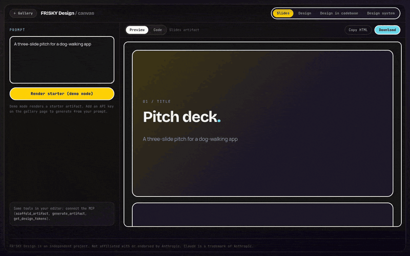
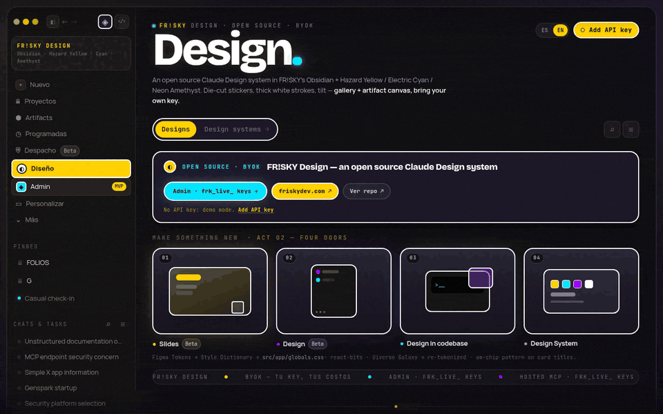
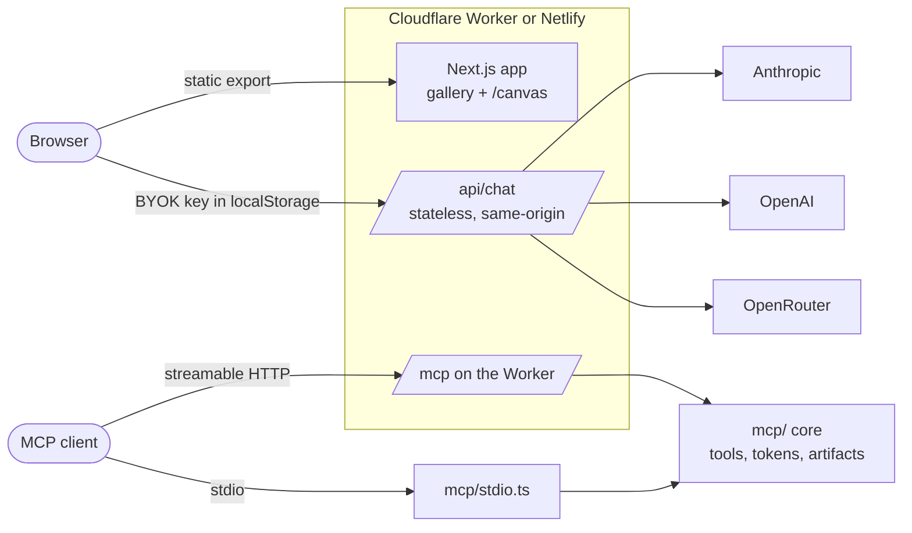

<div align="center">



# FR!SKY Design

**FR!SKY Design. An open source Claude Design system: gallery + artifact canvas, bring your own key, and a hosted MCP when you want it.**

[](https://github.com/FriskyDevelopments/open-claude-design/actions/workflows/ci.yml)
[](LICENSE)
[](https://github.com/FriskyDevelopments/open-claude-design/stargazers)
[](#mcp-server)

[Live demo](https://frisky-design.hrgrrtks2p.workers.dev) · [Quickstart](#quickstart) · [MCP server](#mcp-server) · [Hosted MCP](#connect-the-hosted-mcp) · [Contributing](CONTRIBUTING.md)

</div>

## What it is

I wanted the Claude Design workflow (pick a starting point, describe it, get a real artifact you can keep editing) without a subscription and without being tied to one model. FR!SKY Design is that, as a small Next.js app plus an MCP server:

- **Gallery.** Starting points for slides, product designs, components in code and design systems.
- **Artifact canvas.** Prompt on the left, a sandboxed live preview on the right, then copy or download the HTML.
- **Bring your own key.** Anthropic, OpenAI or OpenRouter. The key stays in your browser's `localStorage` and passes through a stateless same-origin proxy. No database, no logs.
- **MCP server.** The same gallery, tokens and generator as MCP tools, over stdio or streamable HTTP, so Claude Code, Cursor, VS Code and friends can create artifacts directly.
- **Self-host anywhere static.** One Cloudflare Worker (or Netlify) serves the static export, `/api/chat` and `/mcp`.

<div align="center">

</div>

## Quickstart

About a minute, Node 22.18 or newer:

```bash
git clone https://github.com/FriskyDevelopments/open-claude-design
cd open-claude-design
npm install
npm run preview        # builds, then serves the app + /api/chat + /mcp on http://localhost:8787
```

Open `http://localhost:8787`, click **Add API key**, and pick a card in the gallery. Without a key the canvas still renders starter artifacts in demo mode. For UI work with hot reload use `npm run dev` (port 3000, no `/api/chat`).

## Deploy

[](https://deploy.workers.cloudflare.com/?url=https://github.com/FriskyDevelopments/open-claude-design)
[](https://app.netlify.com/start/deploy?repository=https://github.com/FriskyDevelopments/open-claude-design)

- **Cloudflare Workers** (recommended): `npm run build && npx wrangler deploy`. Config is in [`wrangler.jsonc`](wrangler.jsonc). No secrets are needed for the web app, since keys come from the browser.
- **Netlify**: [`netlify.toml`](netlify.toml) publishes `out/` and ships `/api/chat` as a function. The MCP endpoint is Workers-only for now; use stdio locally.

## MCP server

Four tools ship in the open source core ([`mcp/`](mcp), zero dependencies):

| Tool | What it does |
|---|---|
| `list_gallery` | Lists the gallery templates, optionally by kind |
| `get_design_tokens` | FR!SKY tokens as JSON, CSS custom properties or a Tailwind v4 `@theme` block |
| `scaffold_artifact` | Instant starter HTML for `slides`, `design`, `codebase` or `design-system` (no model call) |
| `generate_artifact` | Generates a self-contained HTML artifact from a prompt with your own model key |

**Local (stdio).** Model keys come from the environment:

```json
{
  "mcpServers": {
    "frisky-design": {
      "command": "node",
      "args": ["/absolute/path/to/open-claude-design/mcp/stdio.ts"],
      "env": { "ANTHROPIC_API_KEY": "sk-ant-..." }
    }
  }
}
```

**Self-hosted (HTTP).** Your Worker serves `POST /mcp`. Set `MCP_TOKEN` (`npx wrangler secret put MCP_TOKEN`) to require `Authorization: Bearer <MCP_TOKEN>`. Server-side model keys (`ANTHROPIC_API_KEY` and friends) are only used when `MCP_TOKEN` is set, so an open endpoint can never spend your credits.

## Connect the hosted MCP

If you would rather not run anything, there is a hosted endpoint with a few extras (full gallery search, saved artifacts with share links, design-system export, UI reference search). It needs an API key from a [FR!SKY Design Cloud membership](https://whop.com/friskydev). Model calls stay BYOK: pass your model key as an `X-Anthropic-Key`, `X-OpenAI-Key` or `X-OpenRouter-Key` header if you want `generate_artifact`.

Endpoint: `https://frisky-design-cloud.hrgrrtks2p.workers.dev/mcp`

<details>
<summary><b>Claude Code</b></summary>

```bash
claude mcp add --transport http frisky-design https://frisky-design-cloud.hrgrrtks2p.workers.dev/mcp \
  --header "Authorization: Bearer frk_live_..."
```

Or in a project `.mcp.json`:

```json
{
  "mcpServers": {
    "frisky-design": {
      "type": "http",
      "url": "https://frisky-design-cloud.hrgrrtks2p.workers.dev/mcp",
      "headers": { "Authorization": "Bearer ${FRK_KEY}" }
    }
  }
}
```
</details>

<details>
<summary><b>Claude Desktop</b></summary>

Custom connectors in Claude Desktop expect OAuth, so use the `mcp-remote` bridge in `claude_desktop_config.json`:

```json
{
  "mcpServers": {
    "frisky-design": {
      "command": "npx",
      "args": ["-y", "mcp-remote", "https://frisky-design-cloud.hrgrrtks2p.workers.dev/mcp", "--header", "Authorization:${AUTH}"],
      "env": { "AUTH": "Bearer frk_live_..." }
    }
  }
}
```
</details>

<details>
<summary><b>Cursor</b></summary>

`~/.cursor/mcp.json` (global) or `.cursor/mcp.json` (project):

```json
{
  "mcpServers": {
    "frisky-design": {
      "url": "https://frisky-design-cloud.hrgrrtks2p.workers.dev/mcp",
      "headers": { "Authorization": "Bearer ${env:FRK_KEY}" }
    }
  }
}
```
</details>

<details>
<summary><b>VS Code</b></summary>

`.vscode/mcp.json`:

```json
{
  "inputs": [{ "type": "promptString", "id": "frk-key", "description": "FR!SKY Design API key", "password": true }],
  "servers": {
    "frisky-design": {
      "type": "http",
      "url": "https://frisky-design-cloud.hrgrrtks2p.workers.dev/mcp",
      "headers": { "Authorization": "Bearer ${input:frk-key}" }
    }
  }
}
```
</details>

<details>
<summary><b>Windsurf</b></summary>

`~/.codeium/windsurf/mcp_config.json` (newer Devin Desktop builds use `~/.config/devin/mcp_config.json`):

```json
{
  "mcpServers": {
    "frisky-design": {
      "serverUrl": "https://frisky-design-cloud.hrgrrtks2p.workers.dev/mcp",
      "headers": { "Authorization": "Bearer ${env:FRK_KEY}" }
    }
  }
}
```
</details>

<details>
<summary><b>Other clients</b> (Cline, Zed, Goose, custom)</summary>

Any client that supports streamable HTTP works: `POST` JSON-RPC to the endpoint with `Authorization: Bearer frk_live_...` (or `x-api-key`). Clients that only speak stdio can use `npx -y mcp-remote <url> --header "Authorization:Bearer frk_live_..."`.
</details>

A missing or invalid key returns `401`, an inactive membership returns `402` with a checkout link, and bursts over 60 requests a minute return `429`.

## Architecture



```text
src/app/            Next.js App Router: gallery (page.tsx), /canvas, /admin (local demo)
src/components/     StarPopout, SiteFooter, SupportRail
src/lib/            BYOK storage hooks, helpers
mcp/                MCP core: server, tools, tokens, artifacts, providers, stdio entry
worker/index.ts     Cloudflare Worker: /api/chat, /mcp, static assets
netlify/functions/  /api/chat for Netlify deploys
test/               Vitest suites for the MCP core and the chat proxy
```

## FAQ

**Is this affiliated with Anthropic?** No. It is an independent project inspired by the Claude Design workflow. It works with Claude models through your own Anthropic key, and with other providers too.

**Where does my API key go?** It is stored in your browser. Requests go to `/api/chat` on the same origin, which forwards them to the provider you picked and keeps nothing. Cross-origin requests to the proxy are rejected.

**How is this different from Open Design or Open CoDesign?** [nexu-io/open-design](https://github.com/nexu-io/open-design) and [OpenCoworkAI/open-codesign](https://github.com/OpenCoworkAI/open-codesign) are larger, more complete projects and worth a look. FR!SKY Design is deliberately small: a static app plus one Worker, a zero-dependency MCP core you can read in an afternoon, and an opinionated FR!SKY visual system.

**Can I use it commercially?** Yes, it is MIT. Please use your own name and branding for forks.

**Do I need the hosted MCP?** No. Everything in this repo works self-hosted. The hosted endpoint is there if you want the extras without running infrastructure.

## Contributing

Issues and PRs are welcome. The flow is short: open an issue or PR, Code Pup does a first review pass, I approve, then it merges. Commits need a DCO sign-off (`git commit -s`). Details are in [CONTRIBUTING.md](CONTRIBUTING.md), and there are [good first issues](https://github.com/FriskyDevelopments/open-claude-design/issues?q=is%3Aopen+label%3A%22good+first+issue%22) to start with.

<a href="https://github.com/FriskyDevelopments/open-claude-design/graphs/contributors">
  
</a>

## Star history

<a href="https://star-history.com/#FriskyDevelopments/open-claude-design&Date">
  
</a>

Star it if it helps.

## License

[MIT](LICENSE) © Frisky Developments

<sub>Not affiliated with or endorsed by Anthropic. Claude is a trademark of Anthropic.</sub>
