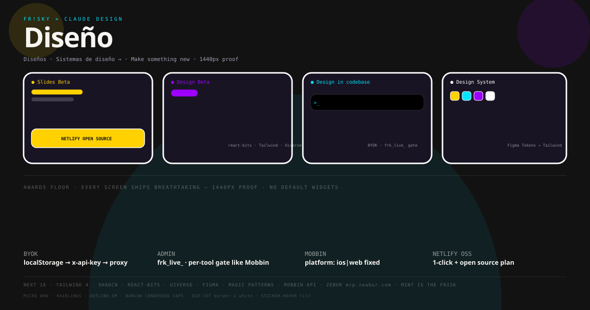

<div align="center">

# Diseño — PUPFR!SKY × Claude Design

### The only open repo that clones `claude.ai` Diseño (Sep 2026) — breathtaking or it doesn't ship.

[](LICENSE) [](https://app.netlify.com/start/deploy?repository=https://github.com/FriskyDevelopments/open-claude-design) [](open-source.netlify.com) [](https://nextjs.org) [](https://tailwindcss.com) [](#awwwards)

**Clean rebuild from visual spec (Mobbin as reference) — no screenshots redistributed.** Inspired by `claude.ai`, not affiliated with Anthropic.



> **[Deploy to Netlify](https://app.netlify.com/start/deploy?repository=https://github.com/FriskyDevelopments/open-claude-design)** · **[Admin `/admin`](src/app/admin/page.tsx)** · **[Support Whop/Donate →](#support)** · **[X promo thread](docs/X_PROMO.md)** · **[We speak english](README_EN.md)**

</div>

## Why this instead of claude.ai or Mobbin

| Benefit | Detail |
|---|---|
| **BYOK — your key, your costs** | `ANTHROPIC_API_KEY` / `OPENAI_API_KEY` / `OPENROUTER_API_KEY` lives only in `localStorage`, sent as `x-api-key`, never on server. ~$3 / 1M Sonnet tokens vs $20/mo subscription. |
| **Total privacy** | `netlify/functions/chat.ts` is a dumb proxy — no DB, no logs. Your prompts never leave browser → upstream. |
| **Any model, same Claude design** | Swap Claude/GPT-5/Gemini (OpenRouter) without swapping UI. Same artifact canvas. |
| **Truly open source** | MIT — fork, rebrand for your agency, `PUPFR!SKY` skin `#121212 / #FFD100 / #00E5FF / #9D00FF` + die-cut `border-2 border-white`. |
| **From Mobbin PNG to repo** | Mobbin Pro = spec only → this is `gallery + generative canvas + streaming` wired to `mobbin_search_*` (platform: `ios|web` fixed) |
| **Netlify 1-click + Admin** | `netlify.toml + @netlify/plugin-nextjs` 60s deploy. [Apply for Netlify Open Source perks](open-source.netlify.com) — see [entry pack](docs/NETLIFY_OPEN_SOURCE.md). |
| **For teams** | One gallery, many BYOK keys — deploy once, each client brings their own key, no shared bill. |

> **vs claude.ai $20/mo:** pay what you consume. **vs Mobbin:** you get the repo + canvas, not just the PNG.

## Deploy to Netlify (1 click) + promo as Open Source

[](https://app.netlify.com/start/deploy?repository=https://github.com/FriskyDevelopments/open-claude-design)

```bash
npm i
npm run build # must stay green — awwwards floor: 1440px proof before merge
# netlify.toml already has @netlify/plugin-nextjs — no env needed (BYOK is client-side)
```

**As Netlify Open Source:** make repo **public** + MIT (`LICENSE`) + **link the live site in README** (above) + apply at **`open-source.netlify.com`** for **Pro team perks** (builds/bandwidth free). Full checklist + deploy button + cross-bump for X: **[docs/NETLIFY_OPEN_SOURCE.md](docs/NETLIFY_OPEN_SOURCE.md)**. Promo pack (hook + 4-post thread, gallery 1440px → `/admin frk_live_` → Figma/jewels → OSS CTA): **[docs/X_PROMO.md](docs/X_PROMO.md)**.

## Local

```bash
npm run dev # http://localhost:3000 → Añadir API key (BYOK modal) → Design in codebase
open http://localhost:3000/admin        # Admin Center — mint frk_live_ keys (frisky-gpt-mcp gate)
```

## BYOK how it works

1. `localStorage.setItem('open-claude-design:keys', …)` → modal (`src/app/page.tsx:ByokModal`)
2. `fetch('/.netlify/functions/chat', { headers: { 'x-api-key': key, 'x-provider': 'anthropic' } })`
3. `netlify/functions/chat.ts` dumb-forwards to Anthropic/OpenAI/OpenRouter — no DB.

Works: `claude-sonnet-4-20250514` · `gpt-5` · any OpenRouter model (same design, any model).

## Admin Center (all tools protected like Mobbin)

`src/app/admin/page.tsx` → `/admin` — owner gate. MVP: `pupfrisky-owner`; prod: **Supabase** owner/admin (`frisky-gpt-mcp/src/http-server.mjs:FRISKY_SUPABASE_OWNER_EMAILS`). Mint `frk_live_…` (**name · scopes · expiry 30d/90d/never · copy-once · revoke**) → `toolPolicy` + `audit_log`. Every `tools/call` without valid **owner JWT or `frk_live_`** → `401 Frisky Client Access login required`.

Scopes in UI: `frisky.mcp` (all tools) + `mobbin:read` + `memory:read` + `github:read` + `model:live`.

Zebuar note: your `zat_…` is expired (`check`). After `zeabur auth login` → `docs/ZEABUR.md` → `mcp.friskydev.com` → `mcp.zeabur.com` canonical.

## Support — Whop & Donations

Icon row (left→right): **[Whop](https://whop.com/friskydev)** — PUPFR!SKY storefront (perks / checkout) · **[GitHub Sponsors](https://github.com/sponsors/FriskyDevelopments)** · **[Ko-fi](https://ko-fi.com/pupfrisky)** · **[Buy Me a Coffee](https://buymeacoffee.com/pupfrisky)**. All via [FUNDING.yml](.github/FUNDING.yml) — the pink Sponsors heart shows on every GH page. Keep it open, keep it pup: one Whop checkout or coffee = more 1440px jewels.

In-app: Sidebar **SupportRail** + footer **Support strip** (`src/components/SupportRail.tsx` — `LINKS` source-of-truth).

## Design system

[MVP spec → Figma + jewels ready for Awwwards.]

## Legal

- Rebuild clean — **no Mobbin PNGs** in repo. Reference only, per Mobbin ToS.
- Name forks `Open Design`, not `Claude Design`.

## License

MIT — [LICENSE](LICENSE)

## Awwwards

**Every screen ships breathtaking or it doesn't ship.** Standard is the floor — mega wow, super wow, always wow, ultra cool, always fixed. No default `<select>`, no unstylized native widgets — everything themed (Barlow Condensed caps · mono labels · hairlines · `outline-em` signature moves) and proven at **1440px** before done. Paste in: **React Bits** (`/react-bits`), **Tailwind jewels**, **Uiverse**, deployed so same palette (#121212 obsidian / #FFD100 / #00E5FF / #9D00FF) + die-cut `border-2 border-white` + aurora `radial-gradient` + `sticker-hover` make it pop. Pimp it.
